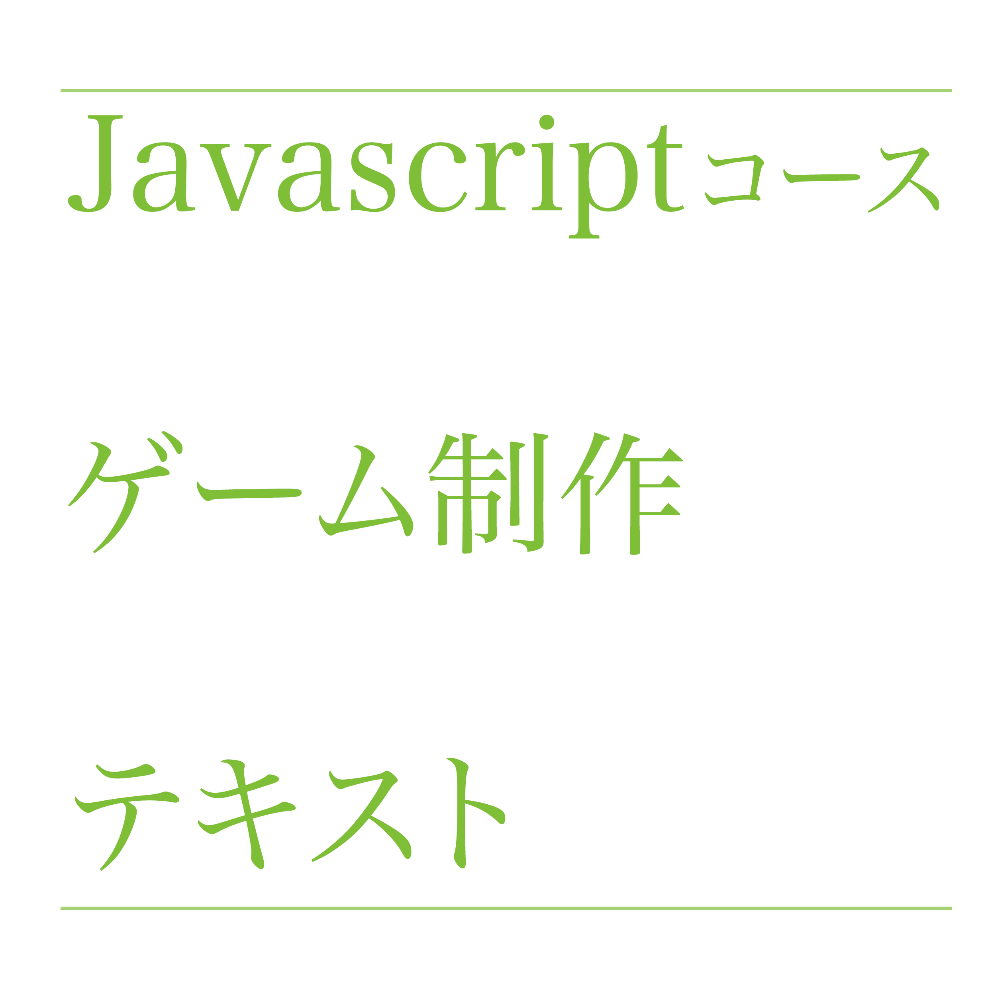

= Javascriptコーステキスト



== 概要

CreateJSを使ってゲーム制作をしていくための手順が書いてあります。

== リンク

以下のリンクからテキストを閲覧できます。

HTML : https://computersciencesummercamp.github.io/CreateJSText/

PDF : https://github.com/ComputerScienceSummerCamp/CreateJSText/blob/gh-pages/how_to_use.pdf

== asciidocファイルのビルド方法

asciidocファイルを他のファイルに出力する方法を記します。

=== PDFに出力する方法

```
 asciidoctor-pdf -r asciidoctor-pdf-cjk how_to_use.asciidoc 
```

=== HTMLに出力する方法

```
asciidoctor -o index.html how_to_use.asciidoc
```
