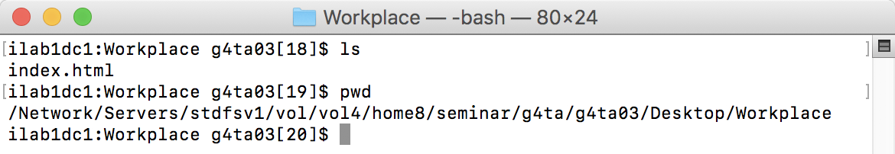
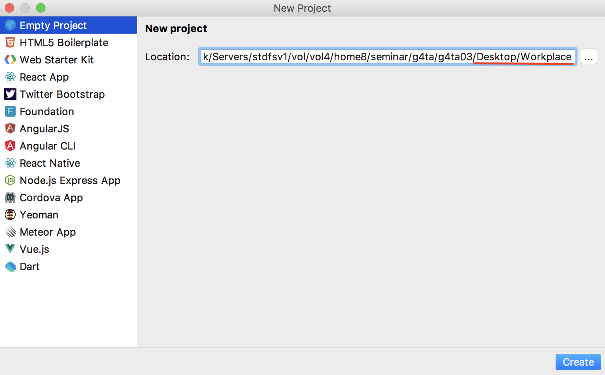
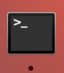

= Javascriptゲームコースサブテキスト

:toc:
:sectnums:

== はじめに

=== パスワードについて

1人づつ名前を呼びますので名前が呼ばれたら前の方にパスワードが書かれた紙を取りに来てください。

* 裏に必ず名前を書いてください。
* カリキュラムの間はケースの中にしまうなどして絶対に無くさないでください。
* 他の人に紙を絶対に見せないでください。
* 後ほど回収しますので指示に従ってください。
* カリキュラムが終わったら必ずログアウトしてください。

=== 諸注意
* 演習室内の飲食を禁じます。
* 目の前のWS機器で携帯などの給電をしないでください。
* 端末の主電源を絶対に落とさないでください。
(学内全マシンに影響が出る恐れがあるので厳守してください。)
* マウスやキーボードのケーブルを抜かないでください。
* 飲食は外のソファ等で行ってください。
* 途中、10分程度の休憩を挟みますがその間はなるべく目を休めるようにしてください。
* トイレは自由に行ってもらって構いませんが近くのインストラクターに断ってから行ってください。
* カリキュラム中に何か困ったことがあったら手をあげて近くのインストラクターを呼んで下さい。

== 2日目以降のグループワークについて

昨日のアンケートを元にゲーム制作のグループ分けを行いました。以下の項目を話し合って決めてください。

* どんなゲームを作るか。
* チームリーダー(受講生の中から1人)
* チーム名
* チームの役割分担

CAUTION: ゲーム制作の時間は限られています。なるべく早く決めてください。目安は30分以内です。

===  ファイルとディレクトリとは？

ゲーム制作に際して、HTMLファイルやjsファイル、画像ファイルなどをひとまとめにして作業を行う必要があります。 +
このまとまりのことを**ディレクトリ**といい、ディレクトリの構成要素を**ファイル**と言います。また、ファイルやディレクトリのある場所を**パス**と言います。 +
日常生活で例えると、ファイルが書類で、ディレクトリが書類を入れる箱と考えればわかりやすいのではないかと思います。 +
ディレクトリ操作に必要なコマンドを以下に示します。上に示したものほど使用頻度が高いと思いますので覚えるようにしましょう。

* `cd _path_`:Change Directoryの略、現在居るディレクトリ(カレントディレクトリという)から__path__の場所に移動できる。
* `ls`:カレントディレクトリに存在するファイル及びディレクトリを見ることができる。
* `cp _file_ _path_`:__file__を__path__の場所にコピーする。
* `mv A B`:以下の二通りの使い方がある。
. ファイルAをパスBに移動する。
. ファイル名Aをファイル名Bに変更する。
* `pwd`:Print working Directoryの略、カレントディレクトリのパスを参照できる。
* `mkdir _directory_`:make Directoryの略、__directory__という名前のディレクトリを作る。
* `rm _file_`:removeの略、__file__という名前のファイルを削除する。
* `rmdir _directory_`:remove Directoryの略、__directory__という名前のディレクトリを削除する。

.lsとpwdの出力例

=== グループワークに取り掛かる前の準備

**チームリーダー**は以下の名前の通りに新しいプロジェクトを作成してください。

その後、ターミナル(下の画像のアイコン)を開いて以下のコマンド上から順にを実行してください。 +
 +
($はプロンプトを表します。)

[source,console]
----
$ cd Desktop

$ chmod 775 Workplace

$ cd Workplace
----

チームリーダーは原則Workplaceというディレクトリのなかで作業を行うようにしてください。 +
そのほかのメンバーは作業ファイルをターミナル上で `$ cp _file_ ~g*js**/Desktop/Workplace/` を実行し適宜Workplaceにコピーしてください。

CAUTION: g*js**はチームリーダーのアカウント名にしてください。

=== ファイル分割について

以下にCreateJSによるゲーム製作におけるファイル分割の例を示します。 +
ゲームの内容は一番最初のサンプルシューティングゲームをキーボード制御バージョンです。 +
ここではゲームに必要な機能を以下のファイルに分割しています。

* 土台となるhtmlファイル(`index.html`)
* ゲームの主要部分を制御するJavascriptファイル(`main.js`)
* キーボード制御を司るJavascriptファイル(`handlekey.js`)
* ゲームオーバーのアラートを出力するJavascriptファイル(`GameOver.js`)

それでは見てみましょう。

.index.html
[source,html]
----
include::game/index.html[]
----

ファイル分割を行う場合、各々のファイルで共通して使用する変数はindex.htmlのbody要素の中の `<script type="text/javascript">` 要素内に `let` を使って宣言しないとなりません。
そうしないと共通の変数を使用することができません。 +
また、src属性を用いて3つのjsファイルを宣言しなくてはそのファイルの機能が反映されません。

.main.js
[source,javascript]
----
include::game/main.js[]
----

CAUTION: jsファイル内で共通の変数を初期化する場合はletをつけてはいけません。

.handlekey.js
[source,javascript]
----
include::game/handlekey.js[]
----

.GameOver.js
[source,javascript]
----
include::game/GameOver.js[]
----

ゲームオーバーのアラートを出力する場合は `GameOver();` と記述させれば出力できます。

実際のゲーム製作では機能毎にファイルを分割してメンバー毎に仕事を分担するようにしてください。
